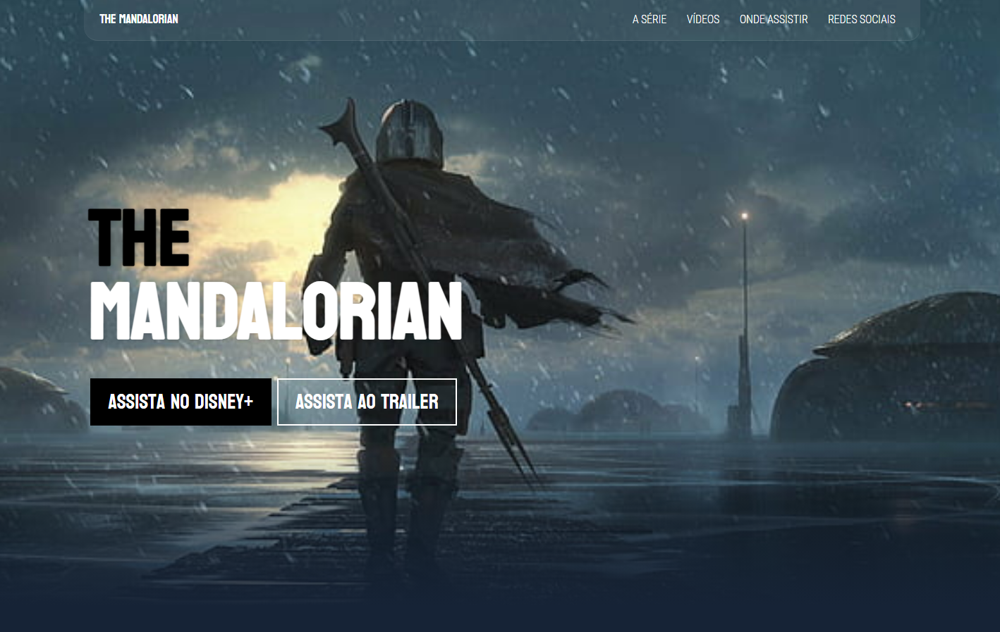

<h1 align="center"> The Mandalorian </h1>

Projeto desenvolvido em conjunto com vídeo aula do YouTube.

  

 

##  Tecnologias

Esse projeto foi desenvolvido com as seguintes tecnologias:

- HTML e CSS
- Git e Github

## Ferramentas

- FontAwesome
- ColorZilla
- Google Fonts

##  Projeto

Um projeto desenvolvido para treino e entendimento de responsividade de elementos, imagens e blocos.

## Link

https://www.youtube.com/watch?v=hfPlTOV3fA0
